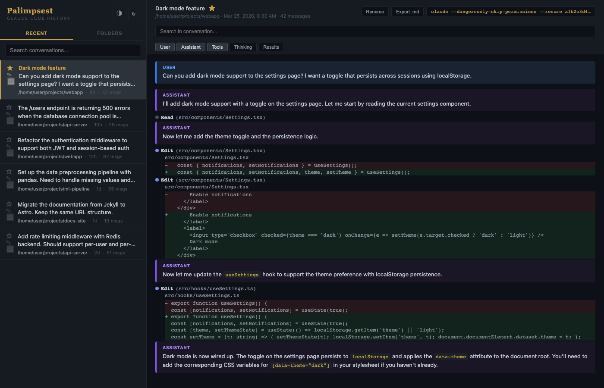

<p align="center">
  
</p>

# Palimpsest

Claude Code history viewer. Reads `~/.claude/projects/` directly. Zero dependencies beyond Python 3.



## Run

```bash
python3 server.py
# http://localhost:4523
# SSH: ssh -L 4523:localhost:4523 <host>
```

Port/host: `PORT=8080 HOST=0.0.0.0 python3 server.py`

## Features

- **Recent / Folders**: two sidebar views — all sessions by recency, or browse by project
- **Search**: full-text across all conversations. UUID queries hit a fast path (~30ms vs ~900ms)
- **In-conversation search**: highlight + scroll to matches within the current conversation
- **Resume**: each session has a clipboard icon that copies `claude --dangerously-skip-permissions --resume <id>`
- **Star / Rename**: inline in the sidebar. Persisted in `~/.palimpsest/meta.json`. Starred float to top
- **Export**: download any conversation as `.md`
- **Filters**: toggle User / Assistant / Tools / Thinking / Results
- **Theme**: dark/light, persisted in localStorage
- **Edit diffs**: red/green inline, expanded by default. Write in green
- **Lightweight**: two files, no build step, no dependencies — easy to extend via Claude Code

## For your Claude Code instance

Two files: `server.py` (API + static server) and `templates/index.html` (entire UI). Metadata in `~/.palimpsest/meta.json`.

Server is a single `HTTPServer` with `do_GET`/`do_POST`. Frontend is vanilla JS — `api(path)` fetches, `post(path, body)` sends. State in `state` object, messages render in `openConv()`, session list in `sessionHTML()`.

Data: `~/.claude/projects/<encoded-path>/<session-id>.jsonl`. Each line is a JSON message with `type`, `message.role`, `message.content`. Reads `.session_cache.json` for fast metadata.

API: `GET /api/sessions`, `/api/projects`, `/api/conversation/<sid>`, `/api/search?q=...`, `/api/export/<sid>`. `POST /api/star`, `/api/rename`.
